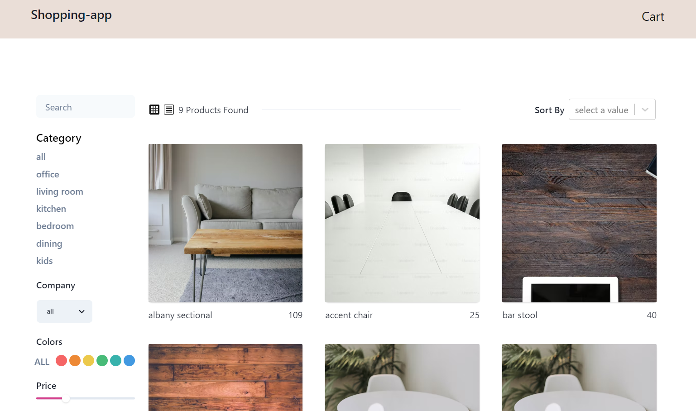

# Reactjs Plays(Projects)
projects to understand React.js , using MongoDB, Firebase,Express.js and node.js.

|# | Plays        | Description                       |
| :-------- | :------- | :-------------------------------- |
|01| Task Manager | A Task Manager site using React.js, MongoDB and Nodejs. |
|02| Store App    | A cart app example with a shopping cart using React.js, MongoDB|

1. ## A Store App

A Shopping site using React.js, MongoDB and Node.js.

