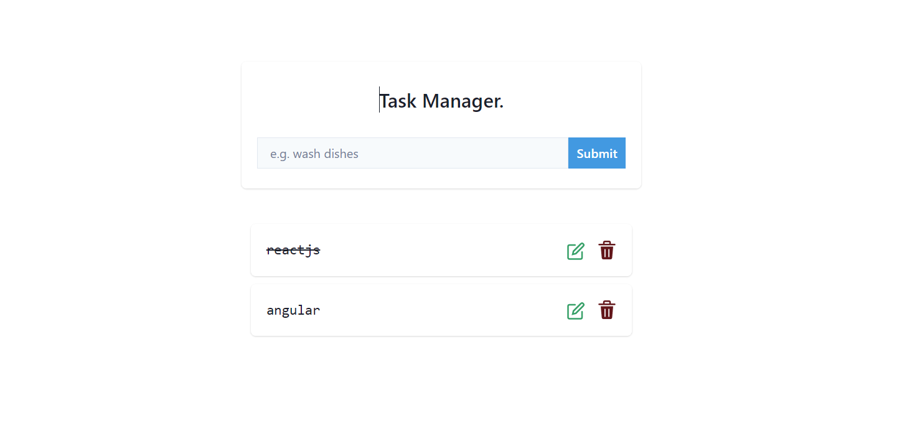

# Reactjs Plays(Projects)

projects to understand React.js , using MongoDB, Firebase,Express.js and node.js.

| #   | Plays          | Description                                                                                          |
| :-- | :------------- | :--------------------------------------------------------------------------------------------------- |
| 01  | Store App      | A Cart App example with a shopping cart using React.js,Context ApI MongoDB                           |
| 02  | Task Manager   | A Task Manager site using React.js, MongoDB and Nodejs.                                              |
| 03  | Auth Dashboard | A very simple dashboard to understand authentication with JWT                                        |
| 04  | Job App        | A Job App by using tech Vite React.js,Context ApI,Nodejs and MongoDB                                 |
| 05  | Online Store   | Nextjs 13 App Router with server components, parallel and intercepting routes as well as Drizzle ORM |

<!-- |02| |  | -->

## 1. A Store App

A Shopping site using React.js,ContextAPI MongoDB and Node.js.

## Features

- creating a general layout, adding React components and styling them with Chakra UI.
- displaying shopping items and filtering them by item.
- displaying shopping items according to sorting by ascending and descending order.
- search item by name,filtering data according to category and by company add also add clear filter button.
- fetching events from Node.js and enabling page rendering for dynamic pages.
- setting up a MongoDB database and getting comments for a specific event.

## 2. A Task Manager App

A TaskManager site using React.js, MongoDB and Node.js.

## Features

- creating a layout, and styling them with Chakra UI.
- adding, editing and deleting task.
- guarding routes to edit, task and create task.

## 3. A Dashboard App

A Authentication site using React.js, MongoDB and Node.js.

## Features

- adding a user signup API route and sending signup requests from the frontend.
- using JsonWebToken.
- protecting routes with client-side.
- working with a localstorage auth provider with JWT token to log in users

## 4. A Job App

A Complete Job App using Tailwind Css React.js,Redux,ContextAPI MongoDB and Node.js.

## Features

- functionality of the login component, including the UI elements, form validation, and handling of login requests.
- add private route component responsible for protecting routes and redirecting unauthenticated users.
- Design the User Interface: Create a form or user interface where users can input the details of the job listing they want to add. The form should include fields for job title, description, requirements, location, and any other relevant information.
- a User can add Jobs: The user will Handle the handle the submission of the job listing.
- Handle Form Submission: In the job addition component, implement logic to handle the form submission. You can use the useState hook to manage the form inputs' state and the handleSubmit function to handle the submission event.
- Connect to Backend/API: Implement the functionality to send the job listing data to the backend or API. You can use Axios or other HTTP client libraries to make the API request to the server and send the job data.
- Validate User Input: Add validation to ensure that the required fields are filled out and that the data meets any specific criteria. Validate the form inputs either on form submission or as the user types in the data.
- Display Success/Error Messages: Provide visual feedback to the user after submitting the job listing. Display success or error messages based on the response from the server to inform the user about the status of their job listing submission.
- Update Job List: Once the job listing has been successfully added, you can update the job list in your application by fetching the updated data from the server or adding the new job directly to the existing list in your React.js state.
- Data Analysis on Monthly job Data using MongoDB Aggregation Pipelines ,worked on a database layer.
